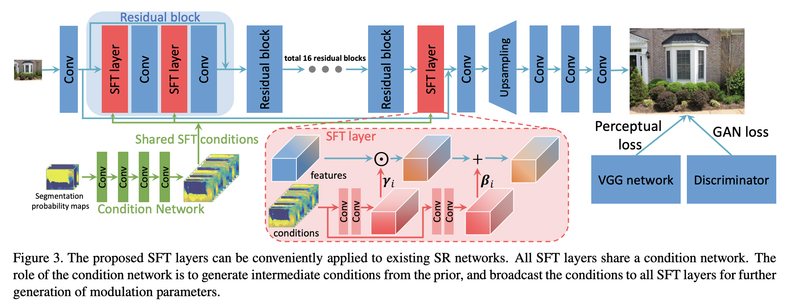

links: https://github.com/TencentARC/GFPGAN

一种人脸高清化的方法，在 stable-diffusion 中被广泛作为插件使用。

GFPGAN 人脸裁剪是 FFHQ，人脸和背景分开来放大，背景使用 RealESRGAN， __调查 v1.4 clean 版本__ 。

架构上采用 resblock 做下采样得出 stylecode，然后 StyleGAN2 上采样恢复。在每层卷积之间对一半通道使用 SFT (Spatial Feature Transform)，别的好像没什么特别的 。

SFT 是由 stylecode 上采样时每一级都会嵌入的变换，每层变换参数由 resblock 下采样层+上采样层得出。理论上是利用一组共享的语义概率特征（condition）给图像做分类来提供超分辨率细节，但实际实现似乎并不是共享，而是直接 encode-decode 多级输出，每层都会用一个新的上采样层解码再生成新的 condition。

换而言之就是共享 encoder，然后分两个 decoder，一个组成类似 UNet 生成多分辨率特征输出，另一个是 stylegan2，把多分辨率特征按照对半通道 SFT 的方式进行生成。

## 尝试
减少 condition 嵌入数量可以看到各种边缘越来越简单。

类 UNet 能生成多级 RGB 输出，看起来每层各司其职（最后一层负责色彩，前面各层对应各层细节），看来是不用缩小图做监督的好处。

也说明总体结构和色彩是由类 UNet 提供，而非 StyleGAN。

直接采用高斯分布的随机数作为 latent 输入到 StyleGAN 中，也可以得到合理的结果，虽然细节差很多：

说明 StyleGAN 在 GFPGAN 中作用非常小，主要负责超分里的细节。而类 UNet 的特征不太好整合，可能难以用于其他任务的特征提取。

## 总结
效果很好，尝试了几个退化图片都非常好，缺点是真得有点假的皮肤，以及高度依赖类 UNet 跳跃链接导致不好做特征提取。
