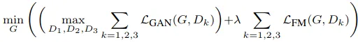
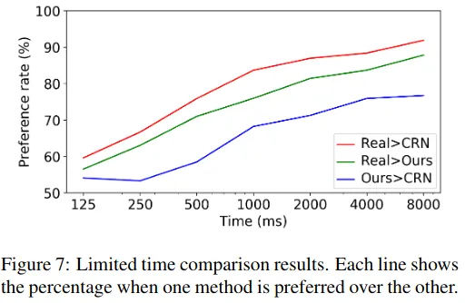

## Pix2PixHD

《High-Resolution Image Synthesis and Semantic Manipulation with Conditional GANs》： https://arxiv.org/pdf/1711.11585.pdf

### Main Contribution
1. 增加一个 loss：真假样本的 Discriminator 的中间特征距离（Feature matching loss），再配合 VGG 之类 Perceptual Loss。_算是最可看的一点。_
2. 高分辨率生成。Generator 使用 Coarse-to-Fine 逐步生成高分辨率，也就是论文里的先训练低分辨率 Global，然后在外面套一层 Local Enhancer 把中间特征跳过去加起来以求得到高清高分辨率。Discriminator 则送进两种尺度的图像。_经过实际验证多尺度输出+多尺度监督会更好，这些都算是落地标配了。_

### Architecture
pix2pix：使用 UNet generator + patch-based discriminator，输出 256x256，直接输出高分辨率的话不稳定且质量低，于是进行改良。  
1. Coarse-to-fine generator

G1 为 global generator 处理 1024x512 图像，G2 为 local enhancer 处理 2048x1024 图像，同样的可以扩增出 G3 等等  
G1 采用架构为：https://arxiv.org/abs/1603.08155 ，其中提到的两个 Perceptual Loss Functions  

  
 

2. Multi-scale discriminators  
  高分辨率需要大的感受野，而更大的卷积核或者更深的网络会有潜在过拟合的可能，且内存增长也很大。于是采用图像金字塔，对输入图缩小几次，得出几种尺度的图像，再根据缩放次数建立多个相同架构的 discriminators 来分别处理各自尺度（Patched Base），最后综合起来得出结果
  
3. Feature matching loss  
  

    
  

  使用各个 discriminator 各层特征的 L1 loss 来让生成图像和真实图像在判别器特征层面上相似，这可以说是类似 Perceptual Loss（在超分辨率和风格迁移很有用的方法）。实验进一步表明，一起使用会有更多提升  
  结合 Feature matching loss 和 GAN loss，得到最终的 loss： 
  
  

    
  

4. Instance maps  
  为了解决 semantic label 无法区分物体的缺点，需要引入 instance maps，但是由于事先不确定 instance 个数，所以不好实现。基于此，作者指出 boundary 才是其中最重要的信息，先计算出 instance boundary map（四邻域里有不同的 label 则为 1，否则为 0），再 concat 一起送入 generator 和 discriminator
  
5. Image manipulation  
  为了使 manipulation 结果多样化且合理，加入 instance-level feature embedding，和 semantic label 一起作为 generator 输入。具体来说，需要额外训练一个 encoder-decoder，最后一层按 instance 进行平均池化，再将池化结果 broadcast 到 instance 每个像素。这样处理完整个训练集后，对各类别使用 K-means 就可以得出多种 instance feature，推理时随机选取一种 concat 输入进行 generate 就可以完成目的。encoder-decoder 的具体训练方法见论文 3.4。

### Implementation Notes
1. 先训练 G1 再训练 G2，最后合在一起 fine-tune，作者提到此多分辨率 pipeline 易于建立，而且一般两种尺度就足够了
2. 为了配合 Instance maps，semantic label 采用的 one-hot 形式
3. 训练方法使用 LSGAN，Feature matching loss 的系数为 10

### Experiments
1. 使用了语义分割网络对真实图像和生成图像进行分割，比较两者的 mIoU 等差异，结果 pix2pixHD 的方法得到的分割指标接近使用真实图像的指标：0.6389 : 0.6857
2. Human A/B tests
  - 非限制时间，500 张 Cityscapes 图像比较 10 次，产生 5000 个结果，统计在两种方法中选取其中一个的概率。结果：未使用 instance map 下 pix2pixHD 和 pix2pix 是 94% : 6%，pix2pixHD 和 CRN 是 85% : 15%，VGG Perceptual Loss 似乎没有起到明显的正负面倾向，对结果影响在 1% 内
  - 限制时间，随机在 1/8s - 8s 间选取时间来展示给受试者，判断那张图片更好，据称可以看出需要多长时间才能意识到两者的差异，大概就是某种程度上能比较差异的粗略显著性  
  

    
  

  - 非限制 loss 比较，GAN + Feature matching + VGG Perceptual loss 比上单独 GAN loss、GAN + Feature matching loss 的 preference rate 分别为 68.55%，58.90%，稍微有一些提升，但不是很明显

_还剩下了几个实验，但这些实际效果都存疑，其实作用都不是特别明显，实验有些偏颇，generator 和 loss 方面的提升应该是最明显的_

__参考：__  
1. https://zhuanlan.zhihu.com/p/56808180
2. https://zhuanlan.zhihu.com/p/68779906?from_voters_page=true

## Vid2Vid
Pix2PixHD 的视频生成改进，主要是针对 temporally incoherent，我没有看论文，只看了一下代码和博客，Generator 大致的修改就是：  
1. Pix2PixHD Global 的本体不变，输入改成前后多帧 concat 起来的图像，并且增加一支将过去几帧生成图像提取出特征加到主支上的分支，大概就是为了利用过去生成的图像来生成现在的图像。这样的话头几帧理论上就需要单独另外提供。
2. 分出一支用来生成光流图和表示模糊程度？的掩码，用光流图 warp 最近一帧生成图像，根据掩码在 warp 的前一帧生成图和当前生成图中做加权，得出最终结果。
3. 如果有前背景的掩码的话，再加一支类似 2 的分支，生成前景图和前景图掩码然后加权。  

也就是说如果不使用前背景的话，实际需要两个 Pix2PixHD 的网络，输入增加前几帧，以及中间提取前几次生成图的特征后的耦合，还有一个光流 warp 的后处理。下面的图非常直观：
https://img-blog.csdnimg.cn/2019030516345690.gif

__参考：__
1. https://blog.csdn.net/maqunfi/article/details/88186935

