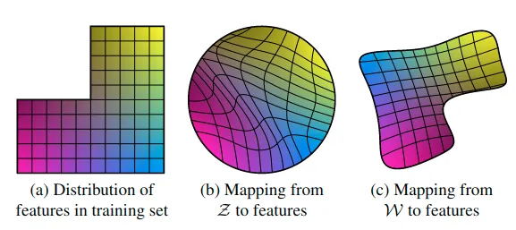

## A Style-Based Generator Architecture for Generative Adversarial Networks

https://arxiv.org/pdf/1812.04948.pdf

### Main Contribution
1. 提出了一种能够控制图像生成过程的生成器架构。通过注入噪声来自动、无监督地分离随机变化（人的各种不同属性，比如发型、雀斑等）以及高层特征（比如人的身份、姿态等特征），同时还能输出特定尺度的风格混合插值图像。
2. 将输入 latent code 嵌入到中间 latent space，对 variation 因子是怎么在网络中表示的有深远影响。作者认为输入 latent space 必须遵循训练数据的概率密度会导致某种程度上必然的纠缠，而中间 latent space 不受限制从而可以免于纠缠（实验在原文 Table 4）。同时文章还提出了 _perceptual path length_ 和 _linear separability_ 两种新的自动化指标来衡量生成器的解缠度。
3. 提出了新的高质量人脸数据集 FFHQ 以及配套代码和预训练网络。

### Architecture

  

和传统生成器相比，使用常数作为输入，并将输入 latent code 经过一个网络映射到中间 latent space，输出 w 经过转换得到用于控制 AdaIN 的两组仿射变换参数 `A：(ys, yb)`：

  

AdaIN 调节各通道的权重来为控制风格混合程度提供基础。最后显示引入噪声 `B` 来引导生成随机细节。  

  

总的来说，基于 Progressive GAN baseline 的改进思路：B. 双线性上下采样（《Making Convolutional Networks Shift-Invariant Again》）C. latent space 映射网络和 AdaIN。D. 发现常规的输入 latent code 已经 no longer benefits，所以使用学习到的一组常数作为替代以简化架构，这时仅对 AdaIN 输入就已经有很好的结果。E. 引入噪声。F. 加上 _mixing regularization_ 来解相关相邻的风格，允许更细粒度地操控。

### Properties
关于为什么网络能学习到各种风格，并通过调节特定某种层的 latent code 就能控制特定某种风格来生成图像，作者的解释：
   > We can view the mapping network and affine trans-formations as a way to draw samples for each style from a learned distribution, and the synthesis network as a way to generate a novel image based on a collection of styles. The effects of each style are localized in the network, i.e., modifying a specific subset of the styles can be expected to affect only certain aspects of the image.
  >
  > To  see  the  reason  for  this  localization,  let  us  consider how the AdaIN operation (Eq. 1) first normalizes each channel to zero mean and unit variance, and only then applies scales and biases based on the style.  The new per-channel statistics, as dictated by the style, modify the relative importance of features for the subsequent convolution operation,but they do not depend on the original statistics because of the normalization. Thus each style controls only one convolution before being overridden by the next AdaIN operation.

### Detail
1. _Mixing regularization_  
  在训练时，一部分图片（论文中用 90% 的训练集）使用两种 latent code (z1, z2) 来生成（在某层前后分别使用两种不同的 z1, z2 生成的 w1, w2 ），防止网络假设前后层风格相关导致依赖。加入这个后，在测试时使用多种 latent code 来混合输出 FID 也不会降低太多。
2. _Stochastic variation_  
  传统生成器从输入层送入随机因素，网络需要消耗容量去转换成所需的伪随机基图像，同时也很难避免周期性。文中采用卷积后直接加入噪声 `B` 来回避这个问题，同时发现噪声的影响被网络很紧密地限定在了局部。作者假设对于生成器的任一点都有压力取生成新的内容，而最简单的方法就是依赖这些噪声。因为每层都有这些噪声的存在，所以不必从更早的激活层去得到这种随机性，这就导致了这种局部效应。（ _这里噪声在不同层的大小对生成图像的纹理、局部细节和整体风格都有些微不足道的有趣的结果，可以看看论文里的图表_ ）  
  由于 latent code 是以同等参数改变所有层的（而且是以仿射变换形式，而非噪声所做的像素级增减），所以风格的全局影响会被剥离出来。这和以往的风格迁移方法（Gram matrix, channel-wise mean, variance 等编码图像风格，然后随空间变化的特征编码具体特例）是一致的。尝试改变噪声来控制风格会使空间上的生成有所偏差从而被判别器惩罚，所以最终不需要明确指导网络也会学习区分全局和局部的控制。

### Disentanglement studies
解缠的一般目的是：latent space 由线性子空间组成，每个子空间控制一种风格变化因素。然而 latent code 的抽样概率（一般是各维度等长来抽，也就是固定的球状分布）需要和训练数据的密度（比如分布是缺了块角的，只有部分人才有的风格）相匹配。这就是 _intermediate latent space_ 存在的目的，能通过学习将抽样空间扭曲到和训练数据相当的程度，从而能更加的线性。  

作者觉得解缠的表示比起纠缠的表示在生成现实图像上会更加容易，所以假设有种压力让生成器去这么做。不幸的是，最近一些研究提出量化解缠度需要一个编码网络来将输入图像编码到 latent code（ _这应该是更加接近现实的合理情况，pixel2style2pixel 算是一个_ ），作者提出了两个替代方法来衡量解缠度。
1. Perceptual path length  
  直觉上来说，一个不那么曲折的 latent space 应该比曲折的 latent space 在感知上输出的图像变化更加平滑，而且在曲折的 latent space 上做插值就会出现明显的纠缠。于是作者提出一种方法，通过对随机两个 latent code 进行随机插值（可以是 z space 上球面插值，也可以是 w space 上线性插值），同时再增加微小增量（1e-4）取插值的邻域，计算两种插值 latent 生成的图像的 VGG 特征的差值平方和（lpips 距离）再除以微小增量的平方，随机采 100,000 次得到期望值作为衡量 latent space 到生成图像的平滑程度的方法。  
  这里对 z 的插值和对 w 的插值会稍有不同，因为 z space 一般是训练时用的随机正态分布（代表训练集的范围，上图 b），而 w space 我们期望是解缠且 flatten 的（代表学习到的特征的范围，上图 c），那对 w 插值可能含有从 z space 映射不来的区域（如一些男性特性在女性中不存在，上图 c 的右下角）。所以区分为两种 PPL 方法，一种是 full-path，就是不管三七二十一取两个随机 z1,z2 生成的 w1,w2 做正常的线性插值得到 w3 及其微小增量的邻域 w4，另一种是限定 endpoints，插值 w 时只取对 z 没影响的小 w，也就是只取随机 z1 生成的 w1 及其微小增量的邻域 w2，这就能确保 w 在期望范围内（原话：`It is therefore to be expected that if we restrict our measure to path endpoints, i.e.,t∈{0,1},we should obtain a smaller lW while lZ is not affected.`）
2. Linear separability  
  作者提出一种通过超平面切分 latent space 将 latent 分到两个不同集的方法来衡量解缠度。首先要得到预训练的特定属性的分类器，用来检测 latent 对应生成图片是否存在对应属性。然后每属性采 100,000 个置信度大于一半的样本经过分类器，得到结果作为标签针对每个属性训练线性 SVM 分类器，计算条件熵 H(Y|X)，X 是 SVM 预测结果，Y 是预训练分类器的结果，最后综合 40 种属性求期望作为分类程度指标。

## Analyzing and Improving the Image Quality of StyleGAN

https://arxiv.org/abs/1912.04958

### Main Contribution
1. 重新设计归一化，解决 StyleGAN 生成图中存在的 artifacts，更换 Progressive GAN 为不需要改变拓扑也能完成由低到高分辨率生成的架构。
2. 使用 perceptual path length 做 metric，并基于此对生成网络做正则化以达到平滑映射，最终发现从图像到 latent space 映射的效果比原始版本明显好得多。

### Detail

1. Architecture  
  原始 StyleGAN 生成图中会出现水滴状 artifacts，而且从 64x64 分辨率特征图开始就被发现存在。文章指出这是 AdaIN 的问题，因为对每通道 feature map 做独立的 normalization 会毁坏掉根据各通道特征图间相对大小发现的任何信息。作者假设生成器故意将信号的强度信息偷偷传到 IN 来垄断统计特性，这样生成器就能像其他地方一样高效缩放信号了（_照这么说所有 Instance Normalization 都会有这个问题，虽然我也没试过 IN 比 BN 要好的情况，即使 batch size 很小_）？实际上去掉 AdaIN 后 artifacts 就消失了。  
  
   作者将 AdaIN 分解为 normalization 和 modulation 两部分，并认为 modulation 的 bias 和 noise 会受到 normalization 中幅度操控的负面影响，而且发现把这两个操作移到 normalization 后会得到更加可预见的结果，而且 mean 也是可以去掉的，最后把常数输入的变换去掉也没有可以观察到的缺点，于是得出架构 (c)  
  
   去掉 normalization 可以让 artifacts 消失，但会失去现有的 style mixing 能力（因为前面层的 mixing 会导致幅度变化，没有及时通过 normalization 抵消这种变化就会影响后续层的 mixing）。作者提出一种通过对输入特征图的期望统计量做非显式强制性的 normalization 来维持这两种优点。具体而言就是对卷积 weights 做 modulation 和 demodulation（_类似 BN 计算图融合，不过引入了动态风格调制的向量_）。modulation 就是每卷积核通道乘上对应调制系数，demodulation 的实现则需要一定弱化，假设输入 activations 是独立同分布的单位标准差的随机变量，那调制后输出 activations 的标准差就是调制后卷积参数的 L2 范数，所以除上这个数就当做 demodulation 了。作者指出这样统计分析在 xavier 和 kaiming 这些网络参数初始化技巧里有广泛应用，但很少用于替代目前这些依赖于数据的 normalization。之前也有工作指出对权重的单位归一化在 GAN 训练中是有益的（ _WGAN 和 Spectral Normalization 应该也是这么回事_ ）

2. Quantitative analysis  
  对生成模型的生成图像质量的量化评价依然是充满挑战性的主题。文章采用了三种方法衡量。一种是 FID，衡量在分类模型的高维特征空间中两分布的密度差异，另一种是 Precision 和 Recall，似乎是一种明确量化 生成图像和训练图像达到相似的百分比 和 能生成的训练数据的百分比？这两种都基于分类器网络，而近期研究表明它们在 ImageNet 上训练后更专注于纹理而不是形状（ [1] ），这和人类的认知方式相反（人更注重物体的形状），这会导致一些 FID 和 P&R 指标一致但质量却很不相同的图像出现。作者观察了第三种方法 percetual path length（PPL）与感知图像质量的关联，这是一种通过计算 latent space 上小扰动下的生成图像间的 LPIPS 距离来量化 latent space 映射到输出图像的平滑度的方法。作者发现平滑的映射空间似乎对应着更好的生成质量。作者假设生成器训练为了减轻判别器的惩罚，最高效方便的方式就是将生成高质量的 latent space 区域扩展，挤压低质量的 latent space 区域，这会在短期增加平均的输出质量，但累计的失真会影响训练动态以及最终图像生成质量。  
  
   话虽如此，也不能直接以 PPL 最小化作为目标（会导致 recall 降低），于是作者提出新的正则化方法。  
  _Lazy regularization_：首先为了降低正则化计算代价，作者发现正则项的计算频率可以低于 loss 的计算频率，比如 R1 正则化每 16 个 mini-batches 才计算一次也不会有损害。  
  _Path length regularization_：鼓励 W 变化固定步长会导致非零固定幅度的图像变化。这通过在图像空间随机方向步进，观察对应的 w 梯度？梯度应该和与 w 或图像空间方向无关的相同长度接近？这表明从 latent space 到图像空间是良定义的。

### R1/R2 正则
为了收敛还用了一种正则化技巧 [2]，也就是 R1 正则化（和 R2 效果相当），大意是以判别器的梯度构建一种惩罚项，让判别器在原始数据分布和生成数据分布上尽可能梯度要小，从而接近收敛的条件（雅克比矩阵特征值有负实部无虚部，且两个分布绝对连续）

### References
1. http://arxiv.org/abs/1811.12231
2. https://blog.csdn.net/w55100/article/details/88091704

## StyleGAN2-ADA  

https://arxiv.org/abs/2006.06676

通过对判别器进行多策略数据扩增，大大减少了训练需要的样本量。为了保证对判别器的扩增不会影响到生成数据分布，需要动态调整扩增的 p。_（不过实际尝试发现还是会有可能影响的，而且用几 k 数据集训练效果也只能差强人意）_ 

### References
1. https://blog.csdn.net/WinerChopin/article/details/113666346

## StyleGAN3
https://nvlabs-fi-cdn.nvidia.com/stylegan3/stylegan3-paper.pdf

StyleGAN2 存在像素粘连的情况，高层特征（纹理等）出现的位置不是由低层特征出现的位置所决定。作者阐明这是由于生成器卷积上采样非线性等结构不当导致的混叠现象（[1] 其实一直都违反采样定理，但因为精度至上所以一直不怎么在意），可以改进让其拥有等变性（平移旋转时纹理跟着生成目标）

看代码核心在于设计低通滤波器在生成器各级上采样时抑制掉高频，只在最高分辨率输出时才允许高频特征，也就是将上采样模块魔改了下

平移等变性则是增加了一些手工设计模块以及输入 latent 处理模块来加强。旋转等变性则是将所有 3x3 卷积换成 1x1 卷积，然后加大通道，并且修改下采样滤波器为径向对称型

### References
1. https://arxiv.org/pdf/1904.11486.pdf
2. https://blog.csdn.net/weixin_38443388/article/details/121050462
3. https://zhuanlan.zhihu.com/p/425791703

## Application
StyleGAN 是一种很有“搞头”的生成器框架，因为它提供了能够生成和提取（增加 encoder）图像的高层、中层、低层语义信息的框架。通过迁移学习或其他方法，就能使用它来生成想要的数据集以及一些语义操控生成。  

### Model interpolation
拿到两个 StyleGAN 生成模型，我们可以通过插值两者的参数来获得其“中间状态”。

### Layer Swapping
拿到两个 StyleGAN 生成模型，交换某些层的参数，由于低层低分率的参数会主导姿态、身份等信息，而高层高分辨率参数会主导颜色、纹理等信息，这样交换后也能得到混合的“中间状态”模型。

### Latent Space Embedding
实际更常见的情况，我们需要根据现实图像来引导 StyleGAN 生成图像，这就需要考虑怎么得到现实图像对应 StyleGAN 的 latent code，目前主要有两种方法：
1. 从随机 latent code 开始，然后用 VGG 之类的网络衡量现实和生成图像的差距，再根据 gradient descent 的方法来训练出最接近的 latent code。在 StyleGAN 的官方实现中有相应代码。
2. 训练一个 encoder 将现实图像映射成 latent code。  

两种方法各有优劣，(1) 主要优势在于稳定而且泛用，可以最大限度利用生成器的潜能，缺点是每张图片都要训练。（2）主要优势在于灵活且快速，可以利用 encoder 来进一步实现高级的语义操控，而且只需要一次训练，推理速度快，缺点是不能泛用。

### Robust
为了测试 StyleGAN 的 robust，采用上述 (1) 的 latent space embedding 方法来探索它的极限，可知道一些关于 latent code 和生成质量的重要细节，其中比较有趣的地方有几点：
- 在一个域中训练好的 StyleGAN 也可以相当程度的通过 latent code 还原其他域的图片。不过该还原的程度和预训练的 StyleGAN 的 latent space 质量有显著关联（FFHQ 训练出来的生成器质量要比 LSUN 的好，实际尝试发现迁移后会变差，大概就是和样本质量有关吧）
- FFHQ 训练出来的 StyleGAN 对仿射变换很敏感，特别是 shift_（以前也试过 shift 会导致生成质量差，大概是生成时默认了中心点的原因）（StyleGAN3 解决了这个问题）_
- 尽管可以还原其他域的图片，但对两张其他域的图片的 latent code 做线性插值然后生成得到的 Morphing 图会十分混乱无意义，而且隐约能看到有类似人脸的图样出现，说明即使是在生成其他域的 latent space 中人脸依然是主要部分
- 还原其他域图片时，从随机初始化的 latent 开始要比从平均的 latent 开始要好，还原预训练域结果相当（不过需要在 W+ space 下）

更多细节参考 [2]

### Pixel2Style2Pixel
设计 encoder 将图像转换成 StyleGAN 的 latent code，再通过该 latent code 调节 StyleGAN 输出以达成各种任务，输出的 latent code 可以是 W space（512），也可以是 W+ space（18x512）

### Encoder4Editing
论文：https://arxiv.org/abs/2102.02766  
和 pSp 的 Inversion 任务只注重还原质量比起来增加了可编辑性，完成训练后编辑的方法分为三种：
  - 沿着一些语义方向（1x512）增加偏置
  - 针对 GAN 空间做 PCA 结果，得出其和原 latent 的协相关偏置？加到原 latent 中
  - sefa 方法，也就是求生成器调制核的因式分解项（矩阵归一化内积求出特征向量），沿特征向量方向增加偏置

### HyperStyle
__论文__： https://arxiv.org/pdf/2111.15666.pdf  
__摘要__：当前 StyleGAN 的 latent space 研究存在重建的精准度和可编辑性之间的 tradeoff 问题。与最近业界使用目标图像微调方法将生成器迁移到可编辑 latent 区域的方法不同，作者提出了用超网络调制 StyleGAN 参数来达到在可编辑 latent 区域重现给定图像的方法，并且设计达到了较低的参数量和较高的推理速度。  
__兴趣点__：在域适应领域上，相比于 pSp、e4e、ReStyle 直接将源域 latent code 应用到目标域生成器上导致各种不匹配的特征增减，该方法通过给源域生成器训练超网络，然后将调制参数的 offset 应用到目标域生成器上来，再迁移 latent code，似乎会还原得更好。  
__锐评__：加上 interfacegan 和 ganspace 修改，纠缠还是有不少的，反转效果还行，域外表现不怎么样，主要和 direction 在域外不好使相关。一次插值生成在 V100 上大约 25ms。总之，没大用。

### References
1. https://www.justinpinkney.com/ukiyoe-yourself/
2. https://arxiv.org/pdf/1904.03189.pdf

