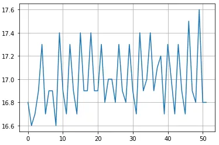
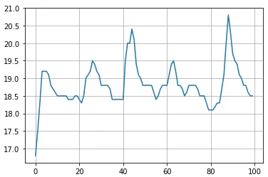
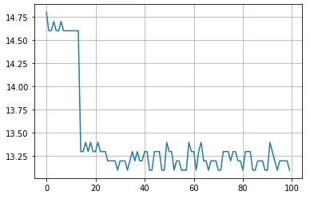

links: [[2022-06-27-Week]], [[103-问题汇总#^7d1ab9]]

这个问题是在优化云端模型时出现的，设计了个更小的模型准备替换大的模型，结果发现模拟视频推理时耗时会出现异常波动，最终达不到优化预期。经过分析发现只在两次推理之间存在一点时间间隔时才会出现这个问题，很是诡异。因为是在云端容器上跑的，没法进行 Nsight 分析，而且我也不懂 GPU，只能默默记录下来。

环境：
- Ubuntu 16.04
- TensorRT 7.2.1
- CUDA 10.2
- cuDNN 8.0
- Python 3.6
- PyTorch 1.7.1
- torch2trt 0.1.0
- Tesla T4
- Intel(R) Xeon(R) Platinum 8255C CPU @ 2.50GHz（up to 10-core）

模型构成：
1. localL（优化 nnt 版本） 和 localC 模型转换成 TensorRT 引擎
2. FP16 和 INT8
3. 1024x576 和 768x448 推理分辨率
4. 初始化预热 20 次

分解测试流程为几个步骤：
1. OpenCV 从 nas 盘读取视频（I/O），转换成 YUV 字节流，以及其余模拟线上环境的配置和 log（I/O）
2. 脚本前处理，涉及 to device 数据传输和少量 CUDA 计算
3. 模型推理，里面是黑箱，涉及显卡内部计算和传输，不涉及 to host 数据传输
4. 脚本后处理，涉及 to host 数据传输和少量 CUDA 计算
5. 后续 log（I/O），以及调用 `time.sleep` 系统睡眠模拟流式处理保持帧率

存在三种场景，未能达成可预见的统一：
1. 测试模型推理，采用相同输入的连续推理的形式
2. 测试脚本，不涉及线上环境模拟部分
3. 测试线上环境

测试方法只记录脚本内部（步骤 2，3，4）耗时，采用 `torch.cuda.synchronize()`+`timeit.default_timer()` 的方式严格记录每一步耗时

## 实验一
localL 1024x576 FP16 和 INT8 做 baseline

测试线上环境，52 帧视频流：
- FP16 耗时 19ms（模型 17ms），GPU 占用 40% 左右，模型推理在一定范围内波动
    - 
    - 前后处理耗时在个别时候有剧烈变化
- INT8 耗时 15ms（模型 13.2ms），模型推理波动很小
    - 
    - 前后处理耗时在个别时候有剧烈变化

测试脚本，循环 100 次：
- FP16 耗时 20.5ms（模型 18.8ms），GPU 占用 90% 以上，模型推理耗时依然波动
    - 
    - 耗时比测试线上环境高，怀疑是 GPU 占用原因
    - 添加 20ms 延时，耗时降低回 16.8ms 水平（比线上稍低一些），波动更明显更规律
    - 
    - 前后处理耗时在个别时候有剧烈变化
- INT8 模型推理耗时有分层情况出现，稳定后和线上环境耗时一致，延长预热后分层消失
    - 

测试模型推理，预热 20 次，循环 100 次：
    - FP16 耗时 20.4ms，GPU 跑满
    - INT8 耗时 15.4ms，GPU 跑满

疑问：
1. 为什么推理时间会有规律性波动
2. 为什么两次推理之间的间隔会影响 GPU 推理速度（为什么连续推理会更慢）
3. 为什么前后处理耗时会偶现高峰值

自答：
- 上述几个问题都表明了一个现象，就是 TensorRT 推理时延和 GPU 利用率相关，这也是几种测试场景下出现不一致的主要原因
- GPU 利用率是统计数据，真正的原因或许在于 GPU 内部管理程序有一定的耗时，两次推理之间必需要经过这一段时间，所以利用 GPU 的空闲时间可以掩盖掉这部分耗时，但当 GPU 相当繁忙时（常有的事）这部分耗时就会显露出来
- 还有的原因或许和 TensorRT 对连续推理的优化有关，这部分暂且不清楚
- 所以实际测试按照 GPU 利用率作为标准或许会更好点，但照目前观察，耗时基本可以代表 GPU 利用率
- 当然感觉也有可能是显卡服务器平台策略有修改了什么，不好说...

## 实验二
localC 768x448 FP16 INT8，小模型推理

测试线上环境，8000 帧视频流：
- INT8 模型推理时间呈现诡异的分层（50 iter 跃变，100 iter 稳定），稳定后 GPU 占用 33% 左右
    - 
    - 可多次复现，分层的时间节点大致相同只会略有偏移
    - 可以确定和延时长短有关，延时越长，分层整体越往左移

测试脚本，循环 800 次：
    - INT8 模型推理在添加 20ms 延时下呈现诡异分层，去掉延时则模型推理耗时正常（4.66ms）
    - FP16 模型推理在添加 20ms 延时下也呈现诡异分层，去掉延时则模型推理耗时正常（5.3ms）

疑问：
1. 为什么推理耗时会表现出阶梯渐慢的样子
2. 为什么最终耗时会稳定在成倍增长的地步

自答：
- 该表现可稳定复现且有明显规律，说明很可能是撞到了某内部机制的误区
- 延时越短，表现越正常；延时越长，越早出现耗时跃变，分层时间也会缩短。也就是可能和实验一是同一类问题
- 需要进一步验证

## 实验三
寻找分层规律，测试所有模型

测试模型推理，预热 50 次，循环 200 次（值为：毫秒）：

| 分辨率/模型 | localC FP16 | localC INT8 | localL FP16 | localL INT8 |
|:-----------:|:-----------:|:-----------:|:-----------:|:-----------:|
|  1024x576   |     8.2     |     7.2     |    19.8     |    15.2     | 
|   768x448   |     5.4     |     4.7     |    12.6     |     9.9     |

测试脚本，循环 800 次，延时 20ms（值为：跃变时次数 / 稳定时次数，√ 为无分层）：

| 分辨率/模型 | localC FP16 | localC INT8 | localL FP16 | localL INT8 |
|:-----------:|:-----------:|:-----------:|:-----------:|:-----------:|
|  1024x576   |   50/300    |   60/300    |      √      |      √      |
|   768x448   |   60/275    |   60/175    |   50/125    |   60/300    | 

分层稳定后耗时分别为（值为：毫秒）：

| 分辨率/模型 | localC FP16 | localC INT8 | localL FP16 | localL INT8 |
|:-----------:|:-----------:|:-----------:|:-----------:|:-----------:|
|  1024x576   |    12.2     |    12.1     |    16.8     |    13.2     |
|   768x448   |    11.4     |    10.1     |    12.4     |    12.4     | 

后续实验：
- 增长延时后全部模型都会分层，减小延时后全部模型不会分层
- 分层最终时间也与延时有关，延时越长，稳定后推理耗时越长
- 将延时函数加到 测试模型推理 场景（也就是步骤 3）中，分层现象依然可以复现，所以可以排除外设总线相关的原因，问题出现在显卡内部

自答：
- 众所周知 TensorRT 在连续推理中做了优化，或许“连续”是指在一定时间范围内，而且这个时间范围会随模型计算量改变。也就是小模型只能在更短时间内才算连续推理，而大模型则宽裕一些。然后破坏连续推理的模式就会使模型推理速度变慢，但这依然没能解释为什么会经历推理耗时正常-线性减速-耗时稳定的现象
- 所以只在这种程度上分析还是有所不足，如果能在本地采用 Nsight Compute 或许能有进一步了解

