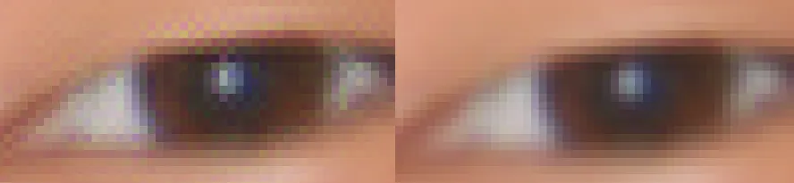
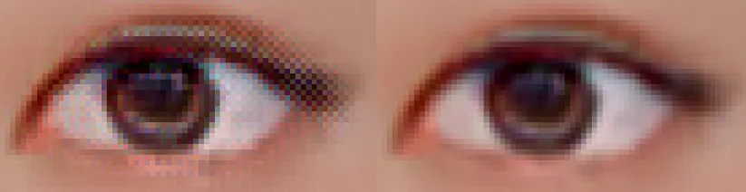

links: [[2022-10-17-Week]], [[2022-10-24-Week]]

将 sub-pixel convolution 用作图像生成的输出层时，依然有可能出现棋盘效应。如图是经过 [“Checkerboard artifact free sub-pixel convolution”](https://www.arxiv-vanity.com/papers/1707.02937/) 改进训练过后的效果（左边为原图，右边为处理后的图片）。在不同的模型、不同的数据、不同的训练方法下该问题严重程度不一，但或多或少都会存在。


解决方法之一是不采用 sub-pixel、transpose convolution 之类的操作，而改用线性或邻近插值来替代，但这样一来计算量过大，而且效果也不太好。


## 解决方案

从信号系统的角度，将解决传统线性时域系统的 checkerboard 问题扩展到卷积上。可以得到一种简单的后处理方法来完全解决这个问题（ https://arxiv.org/pdf/1806.02658.pdf ）

据称：
> It is known that linear interpolators which consist of up-samplers and linear time-invariant systems cause checkerboard artifacts due to the periodic time-variant property.

通过令输出满足一系列约束使得这种因为时变（图像上是空间变化）导致的 checkerboard 得以完全抑制。具体而言就是输出的特征经过上采样零阶保持器，也就是遍历特征把当前点之前（左上方邻域）的值累加起来求平均作为该点输出。效果如下：





代码层面如下：
```python
## 原文中的方法 A 或 B
output = moduel(x)
output = torch.pixel_shuffle(output, out_scale)
# 先填充左上角用于模拟零阶保持器的滞后值输入，其实不用也可以，但是输出图像会往左上移一格
m_pad = nn.ReplicationPad2d((out_scale-1,0,out_scale-1,0)) # ZeroPad2d 也可以
m_blur = nn.AvgPool2d(out_scale, stride=1)
output = m_blur(m_pad(output))

## 原文中的方法 C
## 对于 nn.ConvTranspose2d() 的情况似乎还可以对 weight 进行卷积来做到，不太清楚什么意思
```

看起来效果不错，算法上相当于后处理增加了一次滤波，有不少优化空间。

实际使用会有一点模糊，毕竟仅采用 sub-pixel 能达到的实际分辨率提升很有限。
