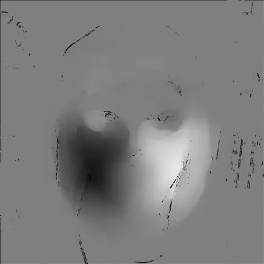
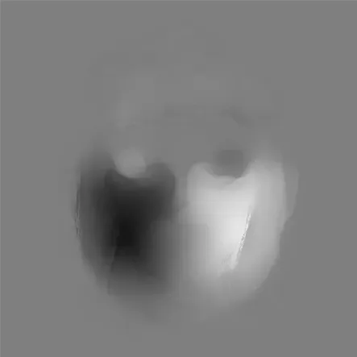

## 迭代更新双线性插值

做光流图像时容易出现很多噪点，将重采样后变化较大的部分 mask 掉，就可以得到相对可靠但是有缺失值（nan）的图像：

突发奇想的一种解决方法就是采集每个以缺失点为中心的 32x32、16x16、8x8、4x4、2x2 的区域（还可以更高）的非 nan 均值，这些均值可以看作一个点的运动（由大范围模糊准确值向小范围精确噪声值运动），再直接取均值就能得到考虑了图像连续性的一个较好的估计。得出结果如下：

这种方法好处在于比较好实现，可以考虑带掩码的全局滤波器组的实现方法，效果应该也不错。而且还能扩展，比如用其他先验方法来取区域和值来代表，以及点的运动也可以引入先验知识来估计。不知道一般是怎么处理的，反正直接平滑就够用。

朴素的实现方法：

用 pytorch 向量化一下可以到 3ms 这样

